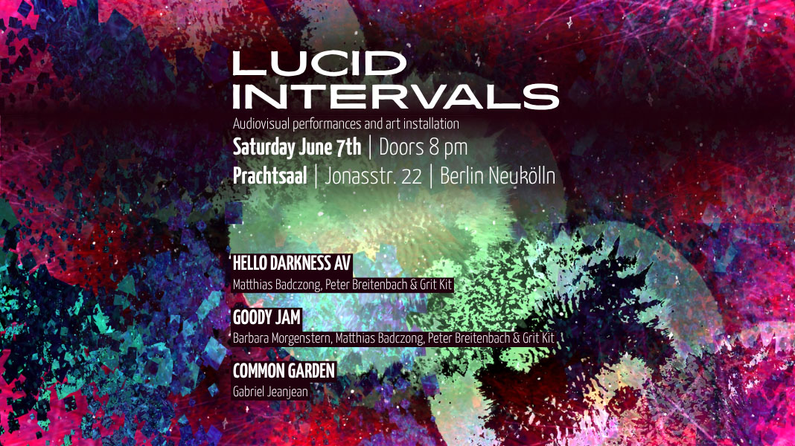
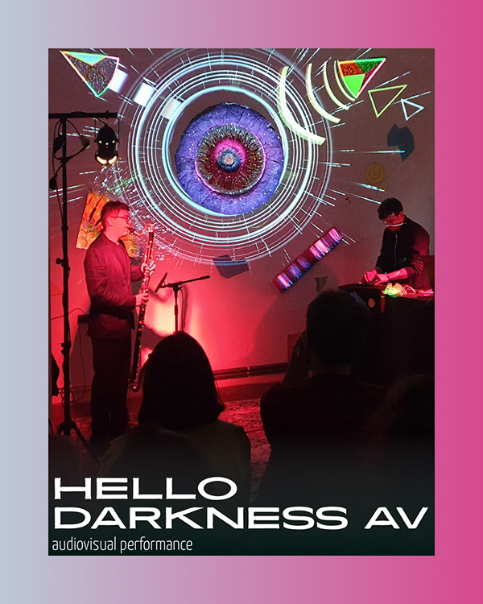
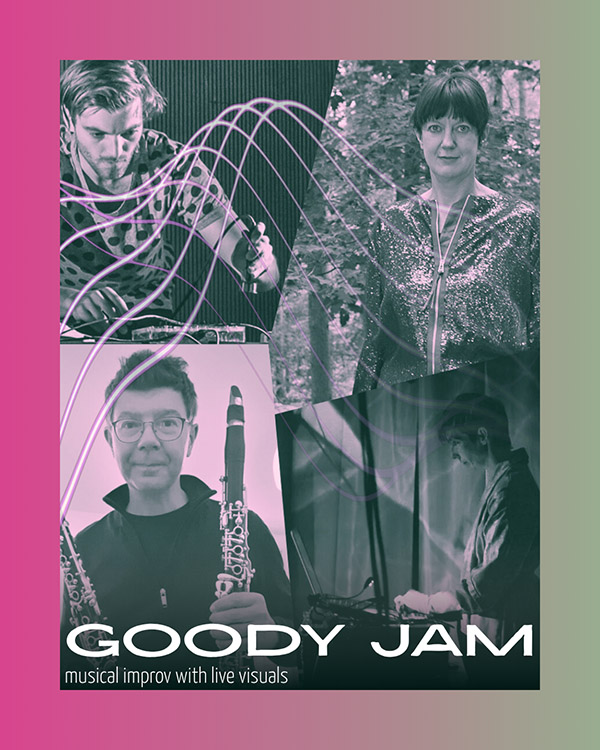
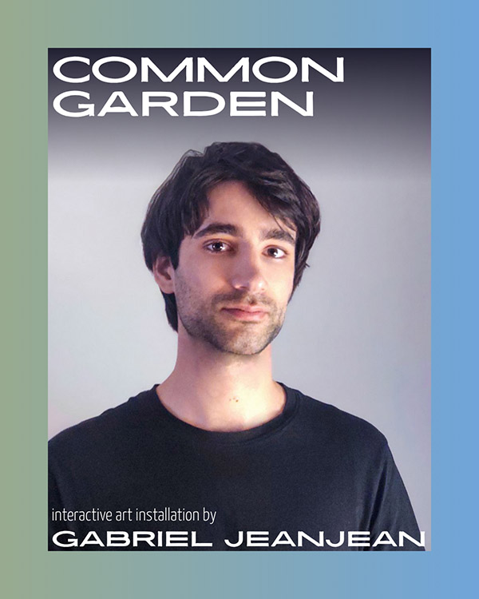

+++
title = "Lucid Intervals"

[extra]
subtitle = "Audiovisual performances and art installation"
description = "On Saturday, June 7th, we are opening our venue to invite you to a synthesis of sound and light. We will present an audiovisual performance, a musical improv set with live visuals, and an interactive art installation."
date = 2025-06-07
endDate = 2025-06-07
tags = ["portfolio", "news"]
+++

On Saturday, June 7th, we are opening our venue to invite you to a synthesis of sound and light.
We will present an audiovisual performance, a musical improv set with live visuals, and an interactive art installation.

The audiovisual performance HELLO DARKNESS AV by musicians Matthias Badczong and Peter Breitenbach, along with video artist Grit Kit, will be performed for the second time.
Acoustic and electronic sounds interact, weaving a conversation that transforms into visual shapes and movements.
On the visual level, projected light blends with the pigments of paper sculptures, creating engaging impressions of color.

For the GOODY JAM performance, the three artists will be joined by musician Barbara Morgenstern. Together, the four will improvise, playfully uniting their forms of expression through synthesizers, electronics, clarinet, and video projection.

COMMON GARDEN by multidisciplinary artist Gabriel Jeanjean is an interactive social sculpture featuring recycled materials, video mapping, and programming designed to interact with a live installation.
It proposes interacting with a world through a digital interface, witnessing in real-time the effects of our data-based decisions.
The project questions social structures and highlights the impact of our online practices.
It is part of a larger project titled "Between Pathways", developed by Gabriel since 2025.

## Line-up:

HELLO DARKNESS AV  
Audiovisual performance by:  
Matthias Badczong - clarinet  
Peter Breitenbach - electronics  
Grit Kit - visuals  

GOODY JAM  
Musical improv set with:  
Barbara Morgenstern - synthesizer, electronics  
Matthias Badczong - clarinet  
Peter Breitenbach - electronics  $
Grit Kit - visuals  

COMMON GARDEN  
Interactive art installation by:  
Gabriel Jeanjean

## Doors:

Saturday, 07.06., 20.00

## Participating Artists:

[Matthias Badczong](https://www.klariac.com/)  
[Peter Breitenbach](https://peterbreitenbach.de/)  
[Grit Kit](https://gritschuster.de/)  
[Barbara Morgenstern](https://www.barbaramorgenstern.de/)  
[Gabriel Jeanjean](https://www.gabrieljeanjean.com/)
  

