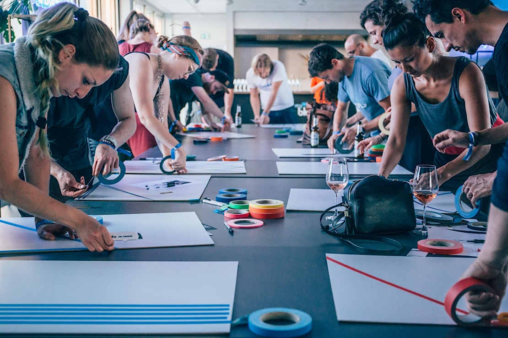

+++
title = "Tape Art Sessions"
date = 2025-07-13

[extra]
subtitle = "Artist-run workshops"
description = "Discover tape art in this 4-hour, hands-on workshop! One of our seasoned tape  artists will share with you the secrets of this bold and fascinating  medium."
endDate = 2025-07-13
tags = ["workshop"] 
+++

Discover tape art in this 4-hour, hands-on workshop! One of our seasoned tape 
artists will share with you the secrets of this bold and fascinating 
medium.

We'll start with an intro to the roots of tape art 
(including right here in Berlin), its evolution from street art and 
graffiti culture, and the techniques that make it endlessly versatile. 
Then you'll be led through the essentials—types of tape, how to use the 
tools, our favorite tape art techniques, and what you need to know to 
create a sick tape artwork of your own. 

You'll have plenty of 
time to explore and create your own A3-sized artwork using colorful 
adhesive tapes. Throughout the workshop, you'll get expert guidance to 
help you refine your vision and bring your ideas to life. 

From 
clean, geometric lines to flowing curves, this art form is all about 
experimenting and finding your unique style. Tape is a forgiving medium –
 there are no mistakes! No experience is necessary—all materials are 
provided, and the workshop will be max. 20 people and is designed for 
anyone curious about trying something completely new. You’ll take home 
an A3 board containing your tape artwork. If you’re ready to create more
 tape art at home, additional materials are available for purchase. 
Whether you’re an experienced artist or just looking for a fresh way to 
express yourself, this workshop will show you how you can use tape to 
shape something extraordinary.

Tape Art Sessions are artist-led, artist-run workshops. We bring
the joy, novelty, and versatility of tape art to the hands of the people!
Right here in Neukölln, you can learn how to create your very own tape art
piece.  Tape art is an accessible art form – you can do it without any
previous experience. We provide all the materials you’ll need at our monthly
workshops for kids and adults!  Berlin is home to many of today’s preeminent
tape artists. These workshops pay homage to that history and encourage folks
of all backgrounds to give it a try! Let’s keep the artistic spirit of this
city alive. 

## Dates

Sunday April 13th at 14:00

Sunday May 18th at 14:00

Sunday June 15th at 14:00

Sunday July 13th at 14:00

## Participate

👉 [Details and registration here](https://www.eventbrite.de/e/tape-art-session-create-your-own-artwork-monthly-workshop-tickets-1296006222499) 👈
  
{{ figure(src="tape_art_sessions_2.jpg", title="Close up of various coloured tapes") }}  
{{ figure(src="tape_art_sessions_3.jpg", title="Proud participants displaying their tape art creations") }}
