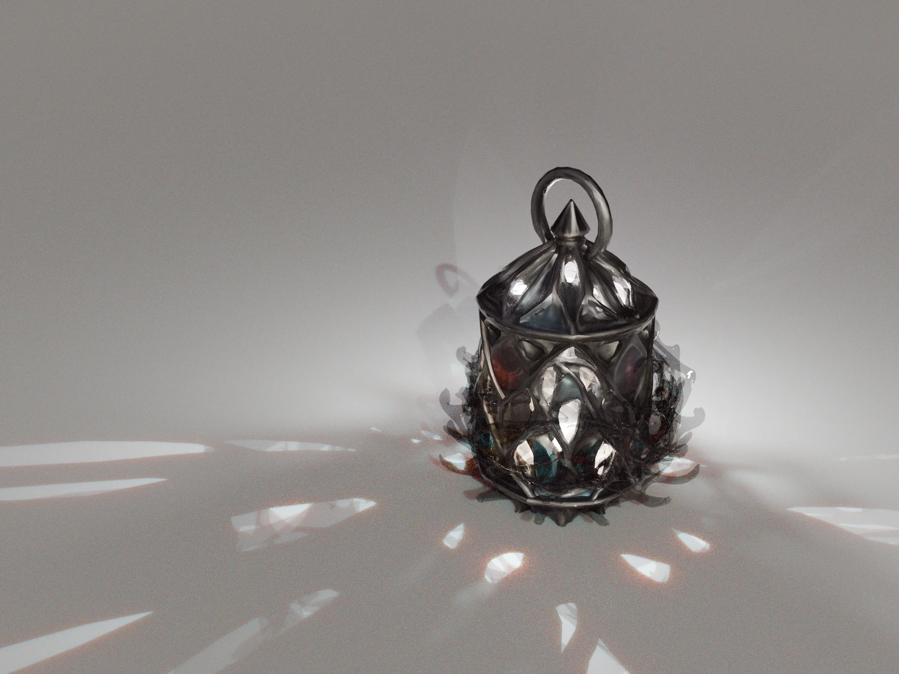

+++
title = "Lanterns Unseen"
[extra]
subtitle = "Berlin Media Art Week"
mainImage = "/assets/img/events/2025-09-04-Lanterns-Unseen/berlin_new_media_week_2025.webp"
description = "This collective exhibition is designed to explore the complexities of presence and perception in the digital age, showcasing time-based artistic positions and real-time conversations."
date = "2025-09-07"
endDate = "2025-09-07"
tags = ["news", "portfolio", "exhibition", "events"]
+++
Prachtsaal will be part of the Berlin New Media Week with a new collective exhibition.

<a href="https://berlinnewmediaweek.com/en/program">Please find the program on the website of the Berlin New Media Week</a>

“Lanterns: Unseen” is a collective exhibition designed explore the complexities of presence and perception in the digital age, showcasing time-based artistic positions and real-time conversations.

In a fleeting moment of encounter, the exhibition offers a glimpse of light that cannot be replicated, inviting viewers to engage and dialogue in a community driven event.

The exhibition features a set of hybrid and multimedia installations. As a community we proposed to host artworks from external artists emphasizing on cooperative art practices. We kept our conceptual framework open to allow for the inclusion of guest works within Prachtsaal's project space.

## Artists

Abe Pazos Solatie  
Eva Resch  
Gábor Ugray  
Gabriel Jeanjean  
Grit Kit  
Hiba Dannane & Ali Khasheei  
Jamal Khalili  
Kazik Pogoda  
Marta Muschietti  
Marta Torres  
Martyna Lebryk  
Michelle Meissner  
Sam Sipahi  
Susanne Schmitt  
Stephan van Kuyk  
Valerio Sangiacomo  
Zack Helwa  

## Opening hours:

Thursday 4 to Sunday 7 September, **18.00-22.00**  
Jonasstraße 22, 12053 Berlin

## Curation:
Michelle Meissner, Gabriel Jeanjean, Martyna Lebryk  
for Prachtsaal Studio

