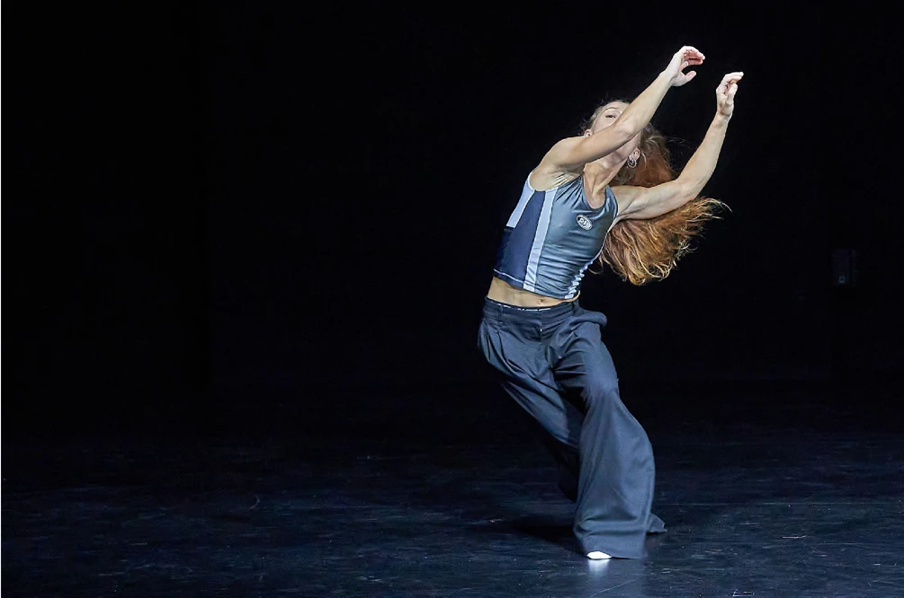
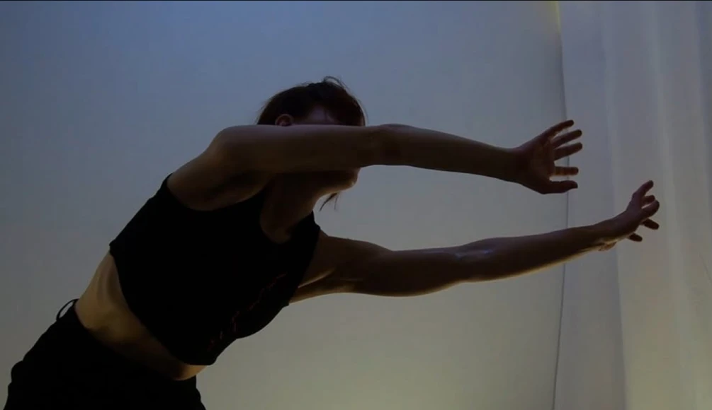
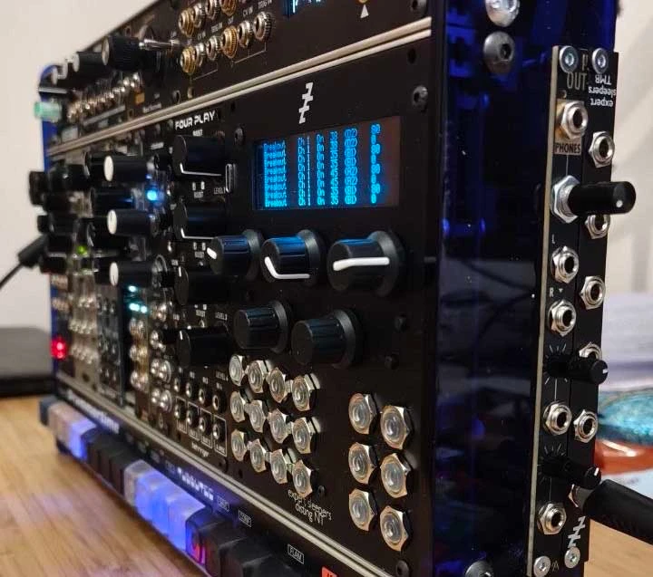
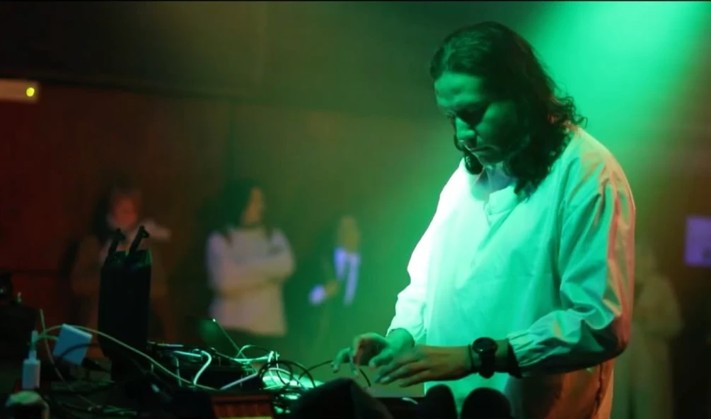
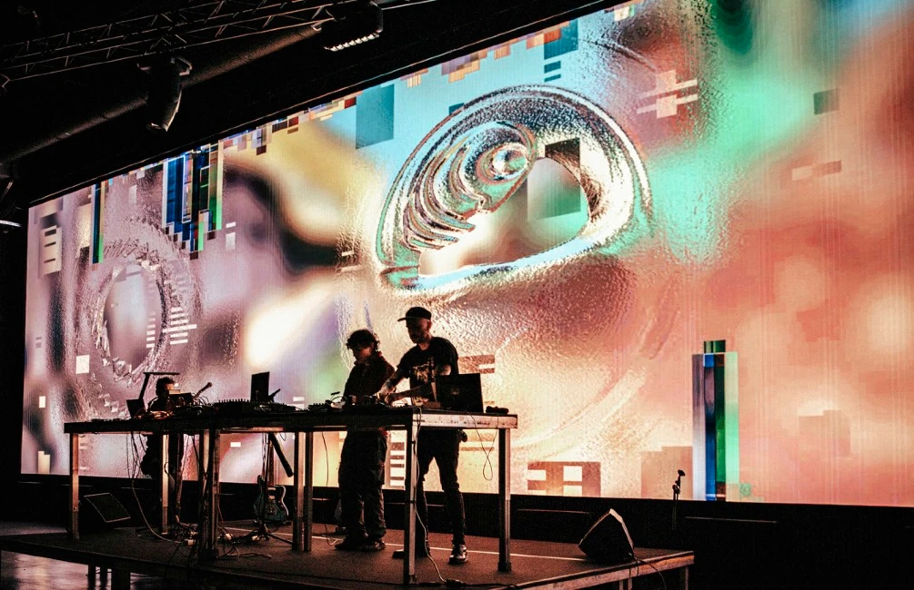
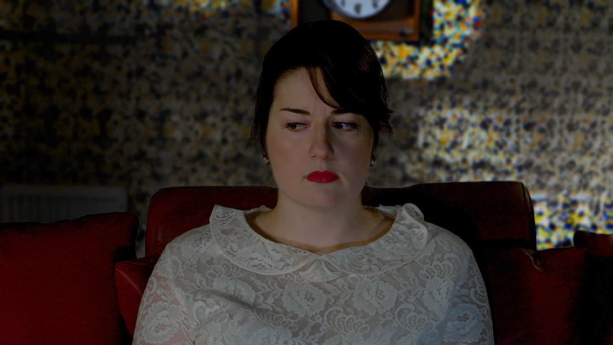

+++
title = '48h Neukölln 2026'

[extra]
archive = true
frontpage = true
subtitle = 'Un-setting / Re-setting'
description = ''
date = 2026-07-03
endDate = 2026-07-05
tags = ['exhibition']
+++

For this year's 48h Neukölln festival, Prachtsaal Studio presents a studio residents exhibition
alongside a programme of live, audio-visual, and performance-based works by resident and invited
artists. By bringing external performers into dialogue with our studio community, we aim to expand
the conversation beyond the boundaries of the exhibition space.

The festival theme, resonates strongly with our situation as an artist-run studio. Titled UN-
SETTING / RE-SETTING, the exhibition grows out of the realities of shared artistic practice.
Twenty artists from different countries work under one roof, negotiating space, language, and ways
of working. Here, borders are not abstract concepts but everyday conditions that shape what is
created and how.

Each artist follows their own path, yet it is the encounters between practices that generate new
possibilities. Material investigations meet cultural references, ambitions challenge perspectives, and
communities overlap. Ideas circulate, collide, and transform.

The exhibition explores these points of contact and tension. Some works remain autonomous, while
others reveal what happens when different artistic languages occupy the same space. Rather than
seeking to dissolve differences, UN-SETTING / RE-SETTING considers what can emerge from
negotiation, diversity, and uncertainty.

Together, the works form a shifting landscape of in-between states, inviting visitors to navigate the
boundaries that connect and separate us.

## Program

### Friday July 3rd, open 18-22Uhr

#### 20:00 - "swallow it!" performance by Romina Geppert

Contemporary dance. The solo swallow it! explores the countless facets of our being
and the acceptance that we are allowed to carry many different roles, traits, and
characteristics within us.

Duration: 5min

[@rom.y.na](https://www.instagram.com/rom.y.na/)

### Saturday July 4th, open 14-22Uhr

#### 17:00 - RED - ROT performance by Ilana Palmgren (Fin)

RED - ROT is a physical performance approaching dissociation as a possible way of
existing. Fragments of movement, electronic sound design and visuals open a space
to consider how transformation might be allowed rather than hidden. The
performance invites the audience into a shared sensorial experience where perception
itself becomes synaesthetic.

Duration: 40min

[@ilanaleksandra](https://www.instagram.com/ilanaleksandra/)

#### 19:00 - live, audio-visual performances

**Luna Nane** (Ger) - modular hybrid live set

Luna Nane is a creative technologist and media artist, focusing on interfaces
and immersive spaces. Her modular hybrid live set is a showcase of recent
interaction studies with the monome grid, which applies music theory and
generative composition tools to the playing surface of this intricate
programmable instrument, and translates it to audio synthesis in an analog
system.

Duration: 30-40min

[@luna_nane_art](https://www.instagram.com/luna_nane_art/)

**Juan Duarte** (Mex) - audio live set

Smoking Mirror (Tezcatlipoca) is a media performance that explores the
relationship between weather data and divinatory rituals, drawing inspiration
from weather mythology of Aztec culture. At its heart, the performance
explores how ancient practices of interpreting atmospheric phenomena can be
reimagined through contemporary technology, creating a bridge between the
past and the present.

Duration: 30-40min

[juanduarteregino.com](https://juanduarteregino.com/About-Juan-Duarte)

**Sebastian Carrizosa** (Col) & **Federico Torres** (Mex) - audiovisual live set

[ˈmɛmᵊri] is an audiovisual project developed by Latin American artists
currently residing in Berlin, Germany. The proposal seeks to preserve and
reactivate the cultural memory of Mexico and Colombia through a sensory
experience that integrates sound and image, establishing a bridge between the
territories of origin and the European space from which the project is
produced. The project stems from the migrant experience of its creators and
the need to keep alive the link with the landscapes, traditions, and everyday
scenes of Latin America. Through experimental music, sound design, and
audiovisual creation, the project proposes a contemporary form of cultural
preservation that moves away from the traditional documentary approach and
situates itself in a poetic and reflective terrain.

[carrimusic.com](https://www.carrimusic.com/)  
[@elfedete](https://www.instagram.com/elfedete/)

### Sunday July 5th

#### 15:00

**Oriental Sexpress, drag performance**

Duration 20 min

[@oriental.sexpress](https://www.instagram.com/oriental.sexpress/)

**Bikini Blåhaj, drag performance**

Bikini (he/him/himbo) is a Clubkid and a Musical Gay. He brings you a fun time with a twist, a party with drama sprinkled in and rhinestones dripping with testosterone.

Duration 20 min

[@bikinidrag](https://www.instagram.com/bikinidrag/)

#### 17:30

**Number 117 performance / experimental theater by Christina Themeli** (Gr)

Number 117 immerses the audience in a system that controls everything — yet nothing is
explained. Malfunctioning objects, absurd cues, and slightly askew gestures hint at rules that
are never revealed. It explores the porous boundaries between inside and outside, action and
consequence, and the invisible structures shaping behavior. The performance unfolds in a
sparse, unspecific workspace — a desk, a chair, a microphone, a fan, a paper shredder —
where tasks, cues, and signals dictate every movement. Timing is precise but subtly off.
Actions are carried out seriously, yet nothing resolves, producing a tense rhythm of
dedication and absurdity.

Duration: 40 min

[christinathemeli.com](https://christinathemeli.com/)
