+++
title = 'Exhibition "Digital Romance"'

[extra]
archive = true
frontpage = true
subtitle = 'Berlin New Media Week'
description = 'Prachtsaal presents the exhibition "Digital Romance" for Berlin New Media Week 2026: immersive media, performances, creative coding and playful installations.'
date = 2026-09-03
endDate = 2026-09-06
tags = ['exhibition', 'events']
+++

Prachtsaal Studio is thrilled to invite you to **Digital Romance**, an exhibition uniting several artistic positions and opening as part of [Berlin New Media Week](https://berlinnewmediaweek.com/en).

A screen glows in a dark room: is it a window, a frame, an image? Somewhere, someone is swiping through faces, profiles, fragments, symbols and signs in a sisyphean search for meaning. Image and text intertwine into a single shapeshifting entity, rendered, rather than engraved. The screen displays an instant communion of pixels generated at a moment's notice, re-encoding itself perpetually.

**Thursday 3 – Sunday 6 September 2026, daily 16.00–22.00, at Prachtsaal Studio, Jonasstraße 22, 12053 Berlin.**

Open to the public — no ticket needed, no entry fee. Feel free to invite whoever you'd like!

## Program

**Thursday 03.09 — Vernissage / Opening Evening**  
19.00 — performance by Elisa Visca

**Friday 04.09**  
19.30 — Creative Code Meetup

**Saturday 05.09**  
14.00–16.00 — FLINTA* TouchDesigner Meetup  
18.00 — Sanki — *Signal*  
19.00 — Gold Kim — *Live Coding and Music*  
20.00 — Odd Sonorous — *Ode to Sorikkot* (소리꽃을 위한 서정시)

**Sunday 06.09**  
17.00 — Decurus — *Reality_v2*  
18.00 — soon~ — *FLÂNEUR*  
19.00 — AVHS & Ones. — *Walk with me, talk to me*  
20.00 — Sebastian Carrizosa & Fernando Torres — *Scenes of a Memory*

## Performers

### Elisa Visca — *205B*

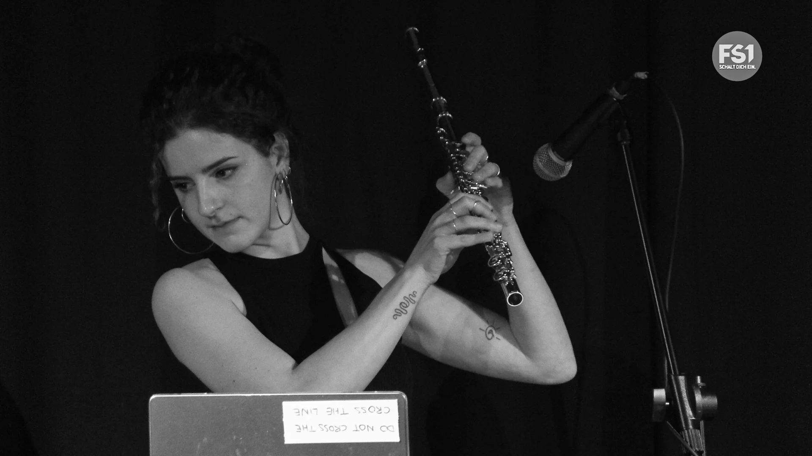

Elisa Visca is an Italian-born, Berlin-based artist working in multimedia art, video production, and AV performance. At the intersection of music and visual art, she combines live visuals, DIY instruments, modular synthesizer systems, and flute into multilayered audiovisual compositions exploring emergence, transformation, and the interplay between human and technological systems.

**Thursday 03.09, 19.00**

[@elis.avisca](https://www.instagram.com/elis.avisca/)

### Sanki — *Signal*

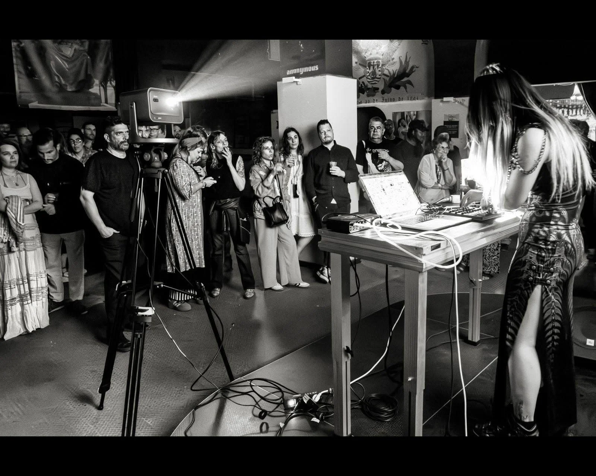

Sanki is a London-based sound and interdisciplinary artist whose practice spans installation, digital media, generative composition, and performance. She weaves sound, visual, and spatial experience to create immersive atmospheres that invite audiences to explore the intersections of sensation and existence.

*Signal* is a live audiovisual performance centred around water, resonance, and unstable signal transformation. A small illuminated water tank functions as both instrument and interface: ripples, bubbles, colour, light, and surface disturbances are captured in real time and translated into sound processes through camera-based analysis and Max/MSP.

**Saturday 05.09, 18.00**

[@sankiiya02](https://www.instagram.com/sankiiya02/)

### Gold Kim (TSE) — *Live Coding and Music*

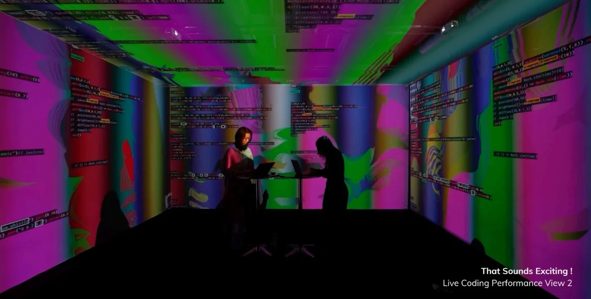

Gold Davin Kim is an artist whose practice centres on listening and writing as ways of exploring invisible connections between human existence and the world. Through the collection and translation of sound into language — and back into sound, image, and performance — they investigate intersections of sensation, memory, and emotion.

This performance transforms the act of live coding itself into a performative experience. Rather than presenting finished compositions, the audience witnesses music being created in real time — mistakes, debugging and improvisation become visible, creative material.

**Saturday 05.09, 19.00**

[@thereddot](https://www.instagram.com/thereddot.jpg/)

### Odd Sonorous — *Ode to Sorikkot* (소리꽃을 위한 서정시)

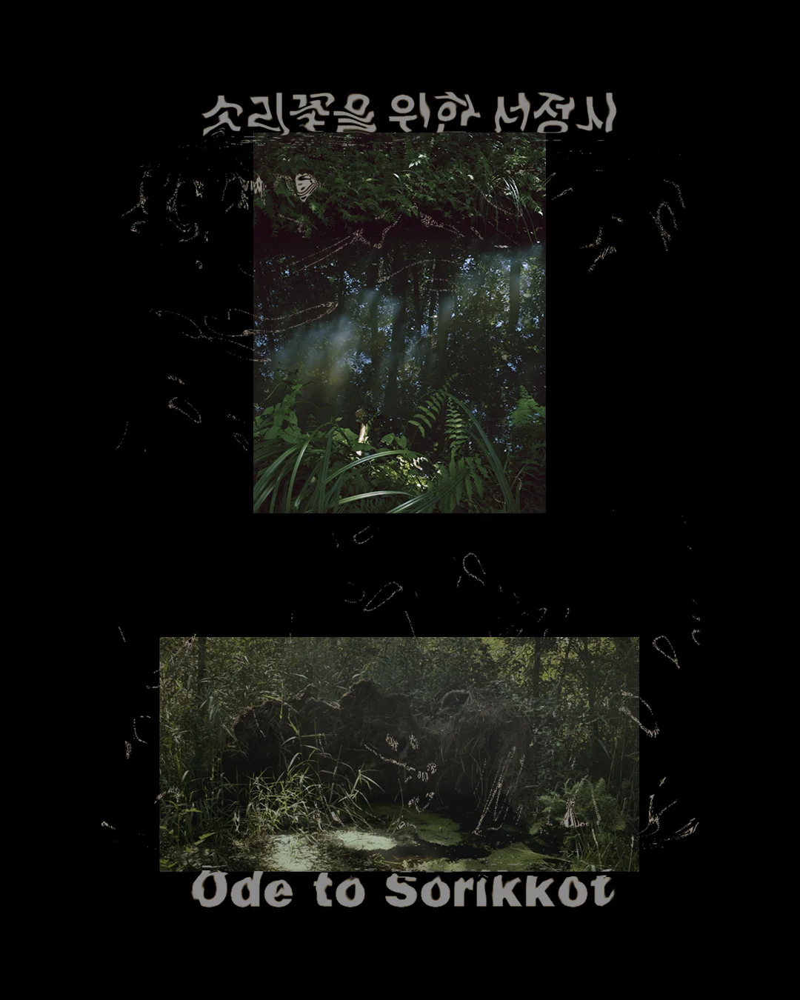

Odd Sonorous is an artist collective founded in Berlin in 2021 by Anna Phaenarete Lioka and Hyewon Suk. Their practice explores the ecological and material dimensions of sound, rethinking the relationships between subject and object, nature and culture, and human and non-human worlds.

*Ode to Sorikkot* is a live audiovisual performance that unfolds as a poetic ritual of collective listening, imagining a time when plants and humans existed in mutual attunement. The performers are seated within a circular installation of soil, plants and embedded loudspeakers, drawing environmental data gathered in real time from the surrounding urban landscape of Berlin into an evolving sonic ecosystem.

**Saturday 05.09, 20.00**

[@oddsonorous](https://www.instagram.com/oddsonorous/)

### Decurus — *Reality_v2*

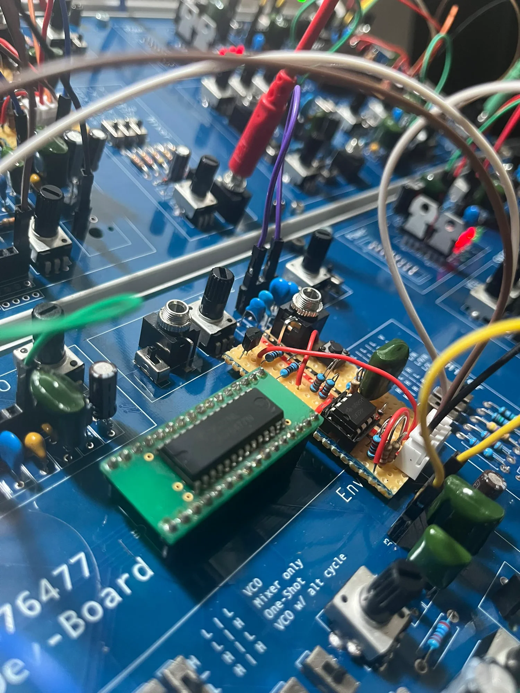

*Reality_v2* is an audio-visual performance built around four SN76477 sound-generator chips — one of the most advanced synthesisers of its time, combining digital circuitry for sound synthesis with analog circuitry for control. These early hybrid chips form the centrepiece of an analog-digital performance whose visuals are programmed in TouchDesigner, taking the audience on a journey that ends in the purest, most undefined form of everything: noise.

**Sunday 06.09, 17.00**

[@decurus_](https://www.instagram.com/decurus_/)

### soon~ — *FLÂNEUR*

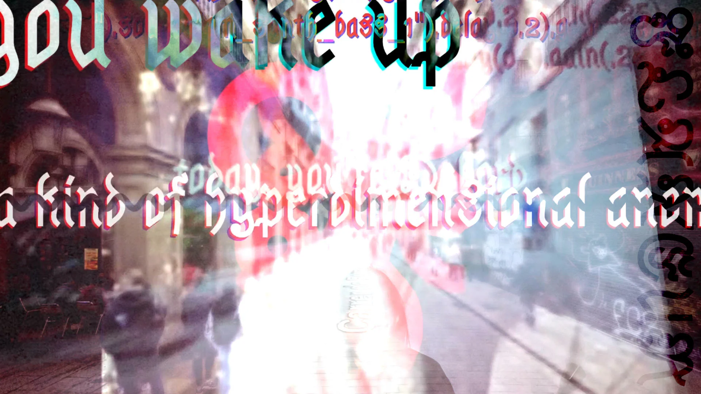

*FLÂNEUR* is a performance of aimless wandering: a psychogeographic poem, chaotically typed over layers of GLSL shaders and a shimmering background of a city in Google Street View. Live coding and partially improvised poetry combine with a crowdsourced soundscape and algorithmic visuals — with the geo-located soundscape drawn in real time from the Freesound.org database.

**Sunday 06.09, 18.00**

[fiala.space](https://www.fiala.space/)

### AVHS & Ones. — *Walk with me, talk to me*

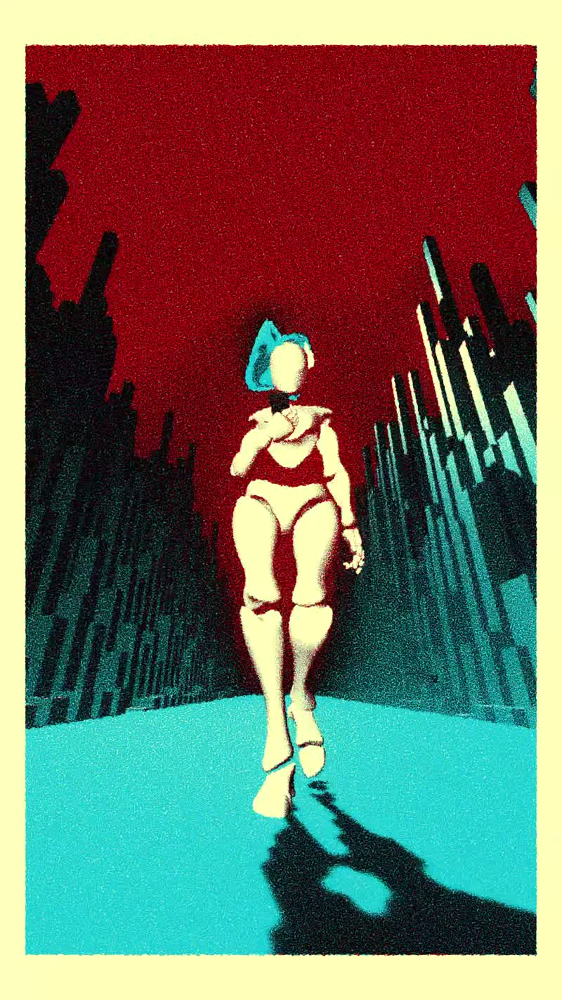

AVHS is a Berlin-based generative visual artist and VJ who transforms music into vibrant, interactive visuals, embracing playful tools — from Xbox controllers to drawing pads — with a sense of joy and experimentation. In July 2024 she founded the TouchDesigner Hang-Outs, a community she now co-hosts with her friend Francesco.

Ones. is a Berlin-based DJ, live act, and co-founder of TMN TRAX, weaving Detroit house with UK garage through a consistent, minimalist lens.

Together, AVHS and Ones. explore how the dynamic ranges of video and sound affect the recipients' emotions and body feelings — fun, weird, and a little bit trippy.

**Sunday 06.09, 19.00**

[@avhs.lindaannanic](https://www.instagram.com/avhs.lindaannanic/) · [@ones.rec](https://www.instagram.com/ones.rec/)

### Sebastian Carrizosa & Fernando Torres — *Scenes of a Memory* ([ˈmɛmᵊri])

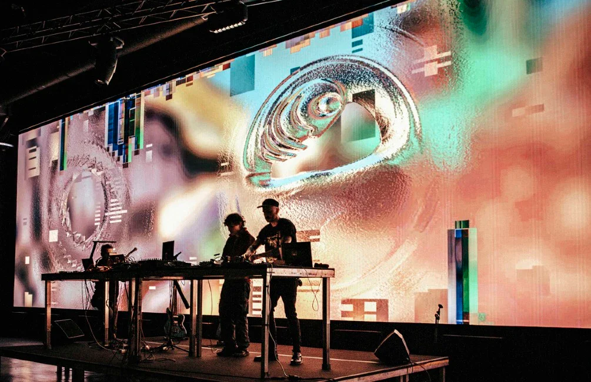

*[ˈmɛmᵊri]* is an audiovisual project by Latin American artists currently based in Berlin, seeking to preserve and reactivate the cultural memory of Mexico and Colombia through a sensory experience that integrates sound and image. Stemming from the migrant experience of its creators, the project builds a bridge between the territories of origin and the European space from which it is produced.

**Sunday 06.09, 20.00**

[@elfedete](https://www.instagram.com/elfedete/) · [@_carrimusic](https://www.instagram.com/_carrimusic/)

### Lucas Kuzma

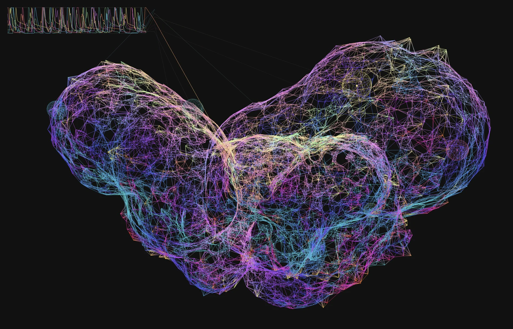

Lucas Kuzma is a Berlin-based musician, software developer, and researcher. He has performed and released electronic music as Claus Muzak since the 1990s, much of it on his own Philtre Com label, and builds the instruments he plays. Through The Strange Agency he built a family of touch-based granular synthesizers for iOS — Curtis, MegaCurtis, Soup, Open Granular — presented at venues including Stanford's CCRMA.

His recent work turns neural networks into musical agents: *Small Network* evolved a 256-neuron spiking network into a compositional engine, released as the album *Sonic Mandala*, while *Folded Bodies* (ICCC 2026) is an audiovisual instrument whose performer sculpts a spiking network by folding the geometry it lives on.

[@the.strange.agency](https://www.instagram.com/the.strange.agency/)

## Exhibition

Alongside the performance program, the studio exhibition features work by:

### Anika Krbetschek

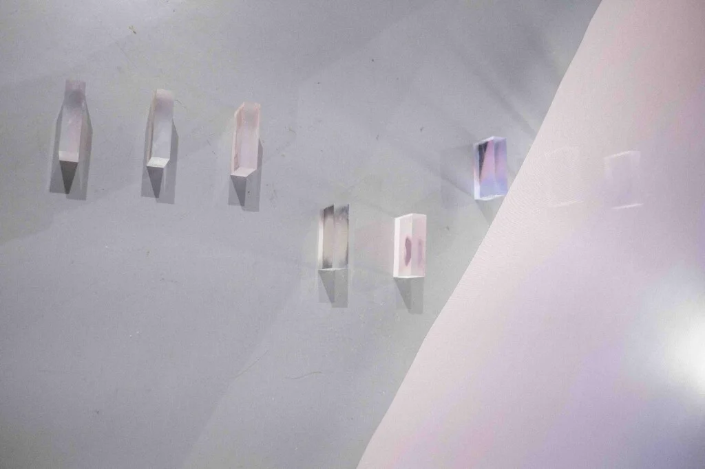

Anika Krbetschek (b. 1997, Berlin) is an interdisciplinary artist, curator, writer, and cultural practitioner with work moving across sound, text, film, performance and curatorial formats, grounded in a listening–distilling practice: a way of working that stays close to lived experience while researching along memory, trauma, resilience and the political conditions inscribed.

[@anikakrb.art](https://www.instagram.com/anikakrb.art/)

### Sin Seeni

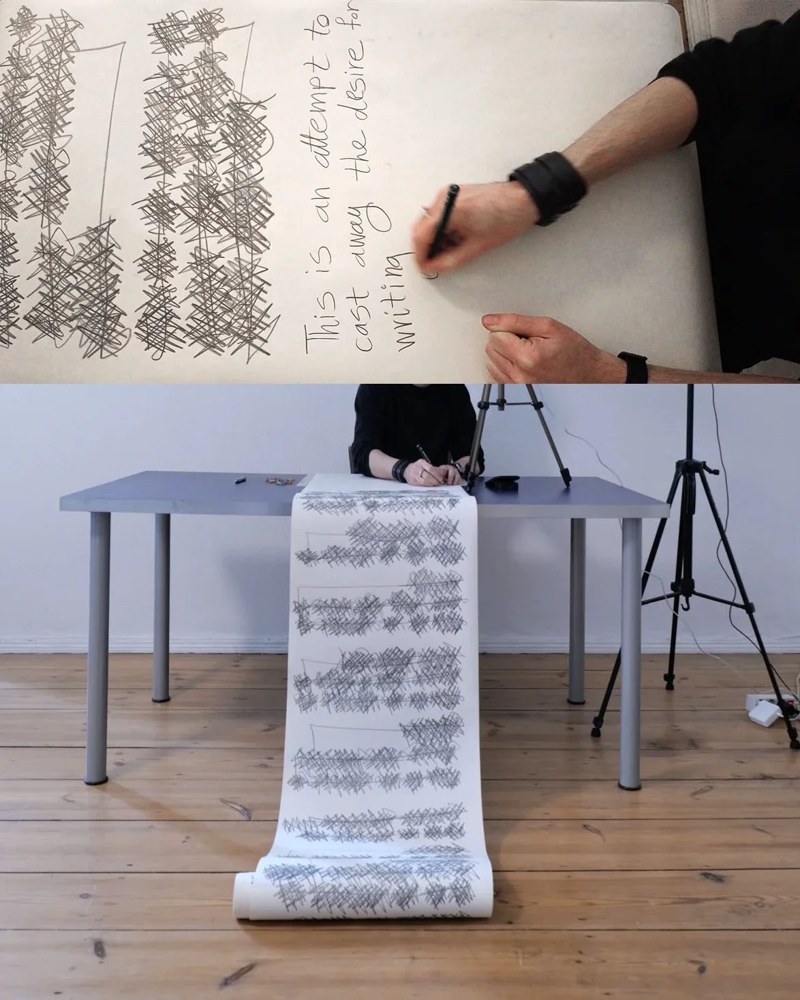

Sin Seeni is an Iranian multidisciplinary artist living and working in Berlin. His works are often multilayered and incorporate various combinations of media, aiming to convey conceptual ideas through linguistic concepts. His works sit somewhere between text and voice, meaning and misreading, structure and collapse, translation and distortion; he puts language under pressure until it reveals its mechanics.

[@sinseeni](https://www.instagram.com/sinseeni/)

### Gabriela Monica Tirziu

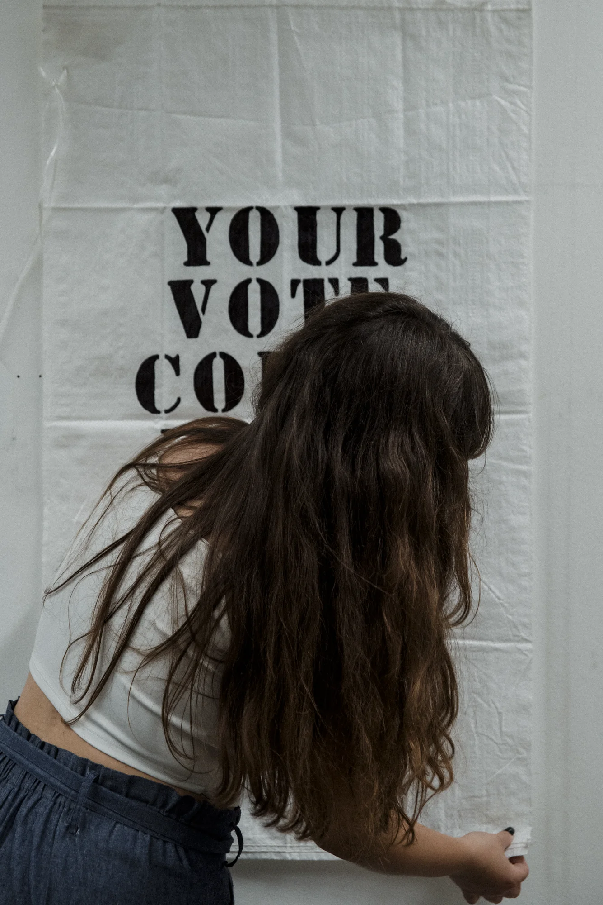

Gabriela Monica Tirziu (b. 1998, Alba Iulia, Romania) is a Berlin-based visual artist whose practice explores the unstable relationships between perception, language, and context. Her work investigates how meaning is constructed and shifted through the ways in which image and text shape, activate, and unsettle one another.

Portrait by Diana Paun, [@didielenaa](https://www.instagram.com/didielenaa/).

[@gabrielamonicatirziu](https://www.instagram.com/gabrielamonicatirziu/)

### MechBullRodeo

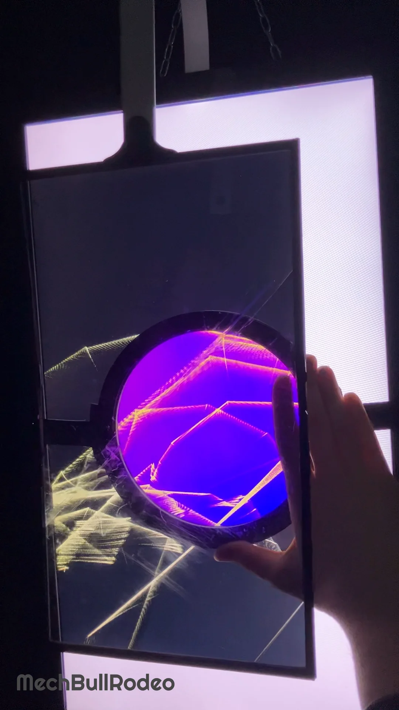

MechBullRodeo is a digital artist working at the intersection of virtual and physical exploration. Their practice moves between screen-based works and installations, where digital systems are often extended into tangible space, creating perceptual instability — situations in which what is seen, understood, or expected begins to shift. Color plays a central role in this process: it can attract and engage, yet also become disorienting, eerie, or emotionally charged.

[@mechbull_rodeo](https://www.instagram.com/mechbull_rodeo/)

### Hoin Ji

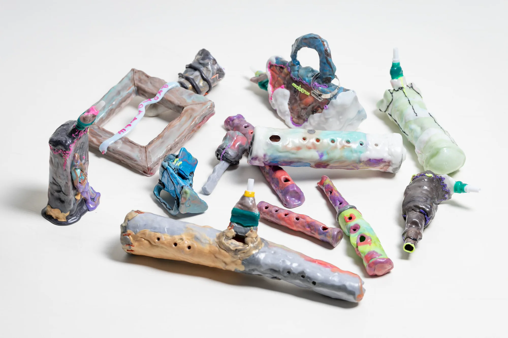

Hoin Ji is an interdisciplinary artist based in Berlin and Seoul, working across sound, media installation, moving image, and sculptural objects. His practice examines how authority becomes embedded in familiar forms, institutional procedures, and clichés — approaching cliché as a language that conforms to power, absorbs its logic, and makes that logic appear natural.

[@hoinji](https://www.instagram.com/hoinji/)

### zillion

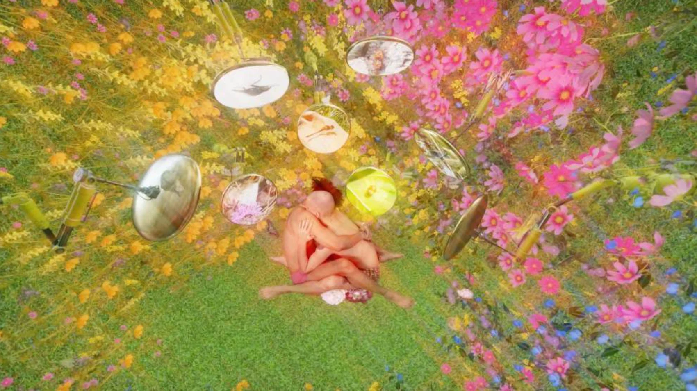

zillion is a mixed media artist living and working in Berlin. Through hi-, low- and non-technology — CGI software, game engines, film, sound design and painting — they research the interconnectedness of society, spirituality, technology and all things alien through a queer-feminist perspective, constructing immersive worlds that imagine alternative futures.

### Ala Leresteux

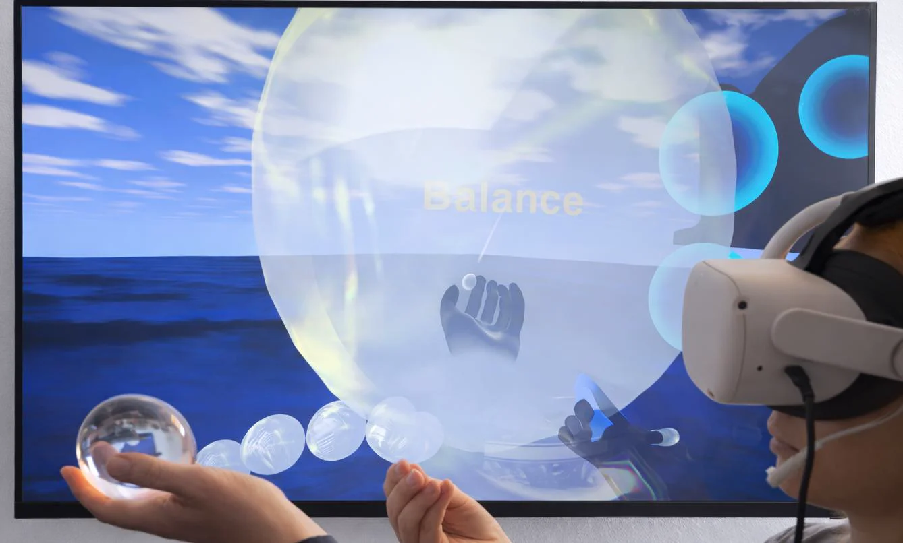

Ala Leresteux is an interdisciplinary artist and curator whose work explores the intersection of contemporary art, science, and immersive technologies. Through participatory installations and virtual reality, she creates experiences that invite audiences to reflect on perception, consciousness, and the human condition.

[@alaleresteux](https://instagram.com/alaleresteux/)

### Gabriel Jeanjean

Gabriel Jeanjean is a multidisciplinary artist whose work bridges contemporary art, storytelling and technology, integrating design, digital media, animation, and curatorial projects, with non-linear storytelling and performative objects. Exhibiting internationally at venues such as Ostermin (Berlin), Le K.A.B (Paris), and MATCA Artspace (Cluj-Napoca), Gabriel has also collaborated on experimental video projects and curated collective exhibitions at spaces like KALT (Strasbourg).

### With exhibits by

#### [Abe Pazos Solatie](@/members/abe-pazos-solatie/index.md)

#### [Ce](https://iivi.co/)

#### [Gabor Ugray](@/members/gabor-ugray/index.md)

#### [Luna Nane](@/members/luna-nane/index.md)

#### [Marta Muschietti](@/members/marta-muschietti/index.md)

#### [Michelle Meissner](@/members/michelle-meissner/index.md)

## Further Links

A few glimpses of what's coming — check out the artists above and follow along with the full [Berlin New Media Week](https://berlinnewmediaweek.com/en) program via [@berlinnewmediaweek](https://www.instagram.com/berlinnewmediaweek/), or come find us at the venue via [@prachtsaal](https://instagram.com/prachtsaal).

<iframe src="https://www.instagram.com/reel/DcZOtIwNc96/embed" style="width:100%;aspect-ratio:5/6;" frameborder="0" scrolling="no" allowtransparency="true"></iframe>

The official program flyer.

<iframe src="https://www.instagram.com/reel/DcROMNAt7R0/embed" style="width:100%;aspect-ratio:5/6;" frameborder="0" scrolling="no" allowtransparency="true"></iframe>

Berlin New Media Week, 2 – 6 September.

<iframe src="https://www.instagram.com/reel/DcBg3cuhf27/embed" style="width:100%;aspect-ratio:5/6;" frameborder="0" scrolling="no" allowtransparency="true"></iframe>

The FLINTA* TouchDesigner Meetup, Saturday 05.09, 14.00–16.00 — a happening for FLINTA* identifying people during Berlin New Media Week.

## Opening hours

Thursday 3 to Sunday 6 September, **16.00–22.00**  
Jonasstraße 22, 12053 Berlin

Full festival program at [berlinnewmediaweek.com](https://berlinnewmediaweek.com/en).

## Curation

[Michelle Meissner](@/members/michelle-meissner/index.md), [Gabriel Jeanjean](@/members/gabriel-jeanjean/index.md), Gabriela Tirziu, [Roberta Maddalena Bireau](@/members/roberta-maddalena-bireau/index.md)  
for Prachtsaal Studio
